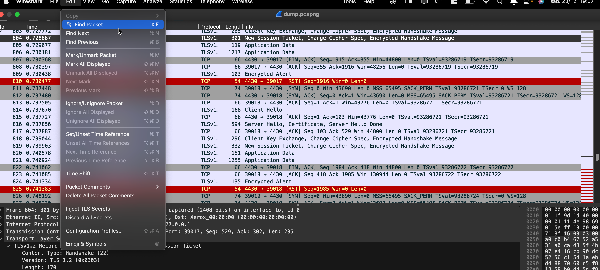
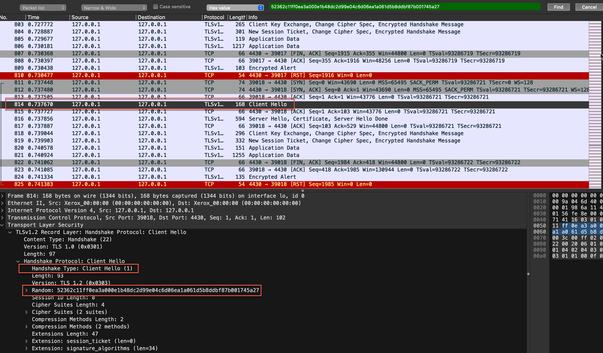
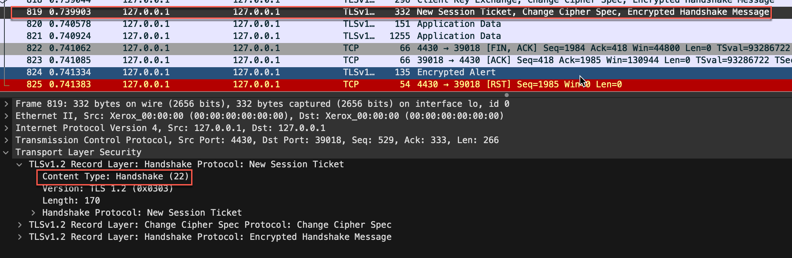
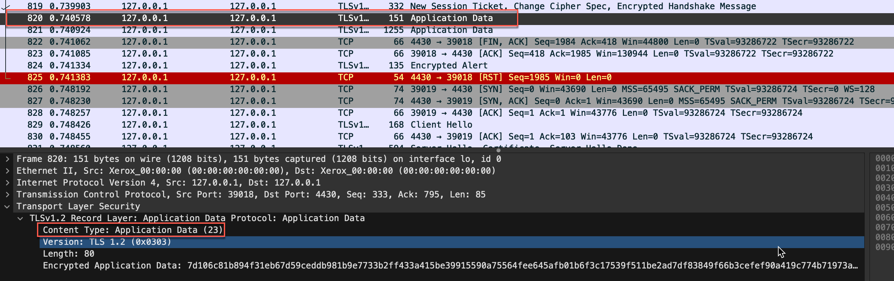
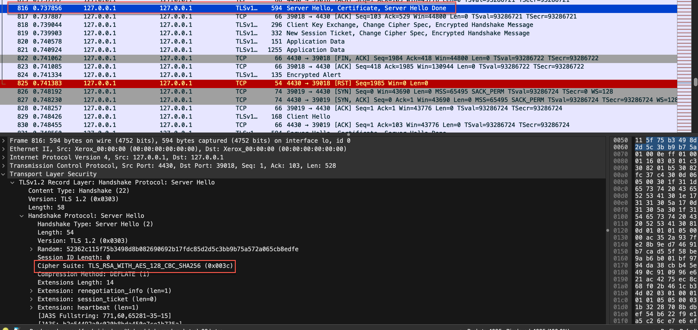
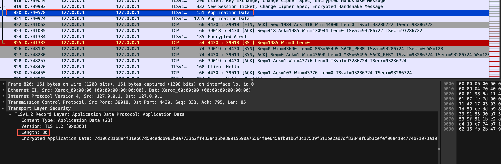
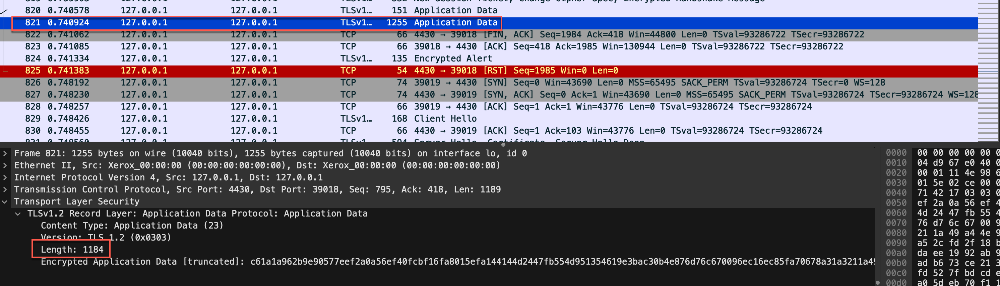
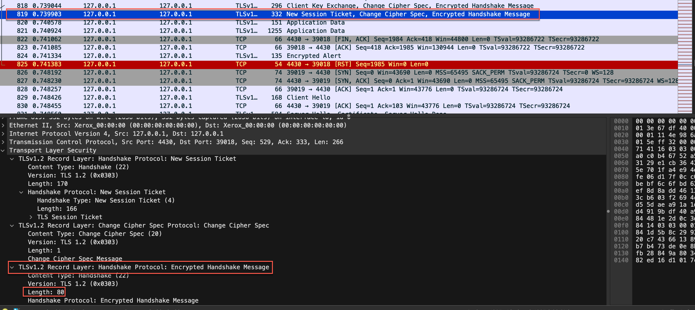

# CTF Find my TLS

The objective of this challenge is to use Wireshark to interpret a PCAP file by inspecting TLS frames to extract information from them. Our goal is to find a specific connection and extract various parameters to build the correct flag.

## Finding the correct TLS connection

We knew from the CTF's description that we should inspect a TLS connection whose handshake uses the number `52362c11ff0ea3a000e1b48dc2d99e04c6d06ea1a061d5b8ddbf87b001745a27` as the random number in the `Client Hello` message. To find the correct connection we used the `Find Packet` functionality in the `Edit` section:

After that we selected the type of filter `Hex value` and inserted the number in the search bar. That returned only one result, the 418th frame, which contains the number `52362c11ff0ea3a000e1b48dc2d99e04c6d06ea1a061d5b8ddbf87b001745a27` in the `Random` field which is indeed a `Client Hello` message:

## Building the flag

To build the correct flag we found the following values:

- `frame_start`: The number of the first frame of the TLS handshake

We know from the theoretical lessons that the `Client Hello` message is the first frame to be sent in the TLS handshake. Since we had already found this frame in the previous step we took note of the number of that frame: `814`;

- `frame_end`: The number of the last frame of the TLS handshake

To find this value we navigated through the TLS frames that come after the `Client Hello` message until we found the first frame that wasn't part of the handshake, which can be checked in the `Content Type` parameter of the TLS frame. The last frame that is part of the handshake is frame number `819`, since the frame number `820` is already application data;

- `selected_cipher_suite`: The ciphersuite's name chosen by the server for the TLS connection;

We found the desired ciphersuite in the `Server Hello` message in frame number 816 under the `Cipher Suite` parameter which had the ciphersuite `TLS_RSA_WITH_AES_128_CBC_SHA256`.

- `total_encrypted_appdata_exchanged`: The sum of the sizes of ciphered data exchanged in the channel until its termination;

There are only two frames that hold application data which are frames 820 and 821. To get the correct value we inspected each of the frames and added the values of the parameter `Length` of both frames together which resulted in the value `80 + 1184 = 1264`

- `size_of_encrypted_message`: The size of the ciphered message in the handshake that ends the handshake procedure

The said ciphered message is in the last frame of the handshake, frame number 819, under the parameter named `Length` in the `TLSv1.2 Record Layer: Handshake Protocol: Encrypted Handshake Message` section. Its value is `80`

Finally to build the flag we knew its structure was `flag{<frame_start>-<frame_end>-<selected_cipher_suite>-<total_encrypted_appdata_exchanged>-<size_of_encrypted_message>}`. We simply swapped each of the field's names for the value we took note of, which resulted in the following flag: `flag{814-819-TLS_RSA_WITH_AES_128_CBC_SHA256-1264-80}`